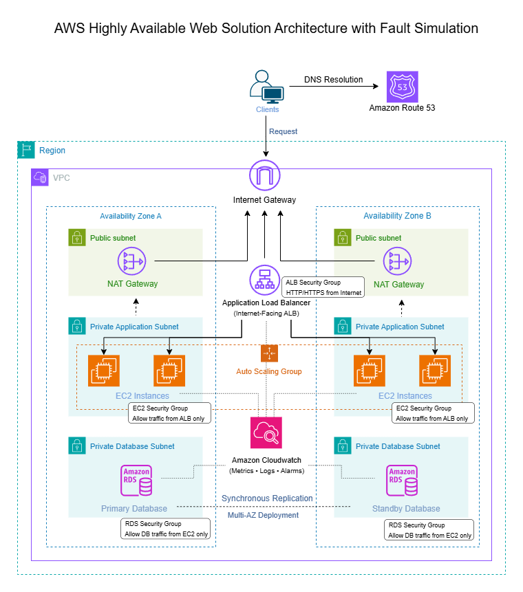

# aws-ha-web-solution-architecture

# AWS Highly Available Web Solution Architecture with Fault Simulation

---

## Solution Overview

This solution demonstrates the design and implementation of a highly available and fault-tolerant web application architecture on AWS using core infrastructure, networking, compute, database, monitoring, and security services.

The architecture follows AWS best practices for:

- High Availability
- Fault Tolerance
- Scalability
- Security
- Operational Resiliency
- Monitoring and Troubleshooting

The solution was designed using:

- Multi-Availability Zone deployment
- Application Load Balancing
- Auto Scaling Groups
- Private subnet isolation
- NAT Gateway integration
- Amazon RDS Multi-AZ deployment
- Amazon CloudWatch monitoring and alerting

Failure simulation scenarios were also conducted to validate resiliency, monitoring visibility, troubleshooting workflows, and recovery behavior during infrastructure and application-level incidents.

---

# Solution Architecture Diagram

---

## Deployment Summary

1. Created a custom Amazon VPC across two Availability Zones
2. Configured public and private subnets for network isolation
3. Attached an Internet Gateway for public internet connectivity
4. Configured route tables for public and private subnet routing
5. Deployed NAT Gateways in public subnets for secure outbound internet access
6. Created Security Groups for layered traffic control
7. Deployed an internet-facing Application Load Balancer across public subnets
8. Launched EC2 instances within private application subnets
9. Configured an Auto Scaling Group for elasticity and self-healing
10. Configured Amazon RDS Multi-AZ deployment for database high availability
11. Integrated Amazon Route 53 for DNS routing
12. Configured Amazon CloudWatch for monitoring, metrics, and alarms
13. Performed fault simulation and troubleshooting validation scenarios

---

## Key Architecture Features

- Multi-AZ high availability deployment
- Application Load Balancer with health checks
- Auto Scaling Group for resiliency and elasticity
- Private subnet deployment for application security
- NAT Gateway for secure outbound internet access
- Amazon RDS Multi-AZ deployment
- Centralized monitoring using Amazon CloudWatch
- Fault simulation and operational troubleshooting scenarios
- Layered network security and traffic isolation

---

## AWS Services Used

| Service | Purpose |
|---|---|
| Amazon VPC | Isolated network environment |
| Public & Private Subnets | Secure network segmentation |
| Internet Gateway | Internet access for public resources |
| NAT Gateway | Outbound internet access for private instances |
| Application Load Balancer (ALB) | Traffic distribution across EC2 instances |
| EC2 Instances | Web application servers |
| Auto Scaling Group | Automatic scaling and self-healing |
| Amazon RDS Multi-AZ | Highly available relational database |
| Amazon Route 53 | DNS routing |
| Amazon CloudWatch | Monitoring, metrics, logs, and alarms |
| Security Groups | Instance and application traffic filtering |

---

# Architectural Decision Rationale

## Why ALB Instead of NLB?

- Supports Layer 7 HTTP/HTTPS traffic handling
- Provides application-aware routing and health checks
- Better suited for web application workloads

## Why Deploy EC2 Instances in Private Subnets?

- Reduces direct internet exposure of internal resources
- Improves overall security posture
- Restricts inbound access to the load balancer only

## Why Use NAT Gateway?

- Enables secure outbound internet access for private resources
- Supports system updates and package downloads
- Prevents inbound public internet access to EC2 instances

## Why Use Amazon RDS Multi-AZ Deployment?

- Improved database availability and resiliency
- Supported standby database failover capability
- Reduced database-related downtime risks

## Why Amazon CloudWatch?

- Provides monitoring, metrics, logs, and alarms
- Improves operational visibility and troubleshooting
- Supports fault detection and incident analysis

## Why Amazon Route 53?

- Provides DNS routing for application accessibility
- Simulates production-style traffic routing
- Improves availability and user access management

## Why Use Layered Subnet Architecture?

- Separated public and private resources
- Improved security and traffic isolation
- Followed AWS networking best practices

## Why Consider Cost Optimization?

- Balanced high availability with infrastructure cost awareness
- Avoided unnecessary enterprise-level complexity
- Focused on efficient resource utilization for portfolio and demonstration purposes

---

# High Availability Design

The architecture was designed with high availability principles to reduce single points of failure and improve application resilience.

Key high availability features include:

- Multi-Availability Zone deployment
- Auto Scaling Group for EC2 instances
- Application Load Balancer for traffic distribution
- Redundant NAT Gateways across Availability Zones
- Amazon RDS Multi-AZ deployment
- Monitoring and alerting using Amazon CloudWatch

---

# Security & Access Control

Security measures implemented include:

- Public and private subnet separation
- Internet-facing access limited to the Application Load Balancer
- EC2 instances deployed in private subnets
- Database access restricted to the application layer only
- Security Groups used to control inbound and outbound traffic
- NAT Gateways used for secure outbound internet connectivity from private resources
- IAM principles considered for controlled access permissions

---

# Monitoring & Alerts

Amazon CloudWatch was used to provide operational monitoring and observability across the infrastructure.

Monitoring capabilities include:

- EC2 CPU utilization monitoring
- Application Load Balancer health checks
- CloudWatch metrics and alarms
- Log monitoring and troubleshooting visibility
- Infrastructure health monitoring during simulated failures

---

# Failure Simulation & Troubleshooting

## Incident 1: Application Unavailable (HTTP 502 Error)

### Root Cause
The Apache web server service was stopped on the application instance.

### Resolution
- Restarted the Apache service
- Verified the target returned to a healthy state
- Confirmed application accessibility through the load balancer

---

## Incident 2: High CPU Utilization

### Root Cause
A stress process was consuming excessive CPU resources.

### Resolution
- Terminated the high CPU utilization process
- Verified CloudWatch metrics returned to normal levels

---

## Incident 3: Application Connectivity Failure

### Root Cause
Inbound HTTP access was not permitted in the Security Group configuration.

### Resolution
- Updated Security Group rules to allow HTTP traffic
- Confirmed restored connectivity through the load balancer

---

## Incident 4: IAM Permission Restriction

### Root Cause
The IAM role did not contain the required authorization policies.

### Resolution
- Updated IAM permissions with the appropriate access policies
- Verified successful access after policy modification

---

## Cost Consideration
Cost optimization considerations were included during the architecture design process.

Key considerations include:
- Using Auto Scaling concepts to optimize compute utilization
- Deploying resources only as required for testing and portfolio and demonstration purposes
- Reviewing AWS Free Tier eligibility where applicable
- Monitoring resource usage through AWS monitoring tools
- Evaluating the balance between availability, resilience, and infrastructure cost

The project focuses on achieving foundational high availability while maintaining awareness of operational cost impact.

---

# End-to-End Request Flow

1. User requests are routed through Amazon Route 53
2. Traffic enters the VPC through the Internet Gateway
3. The Application Load Balancer distributes traffic across EC2 instances
4. EC2 instances within the Auto Scaling Group process application requests
5. Application data is stored within Amazon RDS Multi-AZ deployment

---

## Real-World Architecture Considerations

This solution was intentionally designed using foundational AWS services commonly used in production environments. While simplified for portfolio and demonstration purposes, the architecture follows core cloud design principles including high availability, fault isolation, secure network segmentation, operational monitoring, and scalable application deployment.

---

# Future Improvements

- Infrastructure as Code using AWS CloudFormation or Terraform
- AWS WAF integration
- SNS integration for CloudWatch alarm notifications
- CI/CD pipeline implementation
- AWS Systems Manager integration
- Backup and disaster recovery automation

---

# Skills Demonstrated

- AWS VPC Design
- Multi-AZ Architecture
- Auto Scaling
- Application Load Balancer Configuration
- Amazon EC2 Deployment
- Amazon RDS Multi-AZ
- Route 53 DNS Routing
- NAT Gateway and Internet Gateway Usage
- CloudWatch Monitoring
- Security Group Configuration
- High Availability Design
- Fault Simulation & Troubleshooting
- Cloud Architecture Documentation

---

# Technologies & Services

AWS, Amazon VPC, EC2, Auto Scaling, Application Load Balancer, Route 53, RDS Multi-AZ, CloudWatch, IAM, NAT Gateway, Internet Gateway, Security Groups, High Availability, Fault Tolerance, Monitoring, Troubleshooting

---

# Conclusion

This solution demonstrates foundational AWS cloud architecture design principles aligned with AWS best practices for high availability, scalability, security, monitoring, and operational resiliency. It also highlights operational troubleshooting, failure simulation, and infrastructure resiliency practices commonly applied in real-world cloud environments.

---

# Author

**Name:** Jenifer Eliang Bisarra 

**Certification:** AWS Certified Solutions Architect – Associate (SAA-C03)

---

# License

This repository is intended for educational, portfolio, and demonstration purposes.
